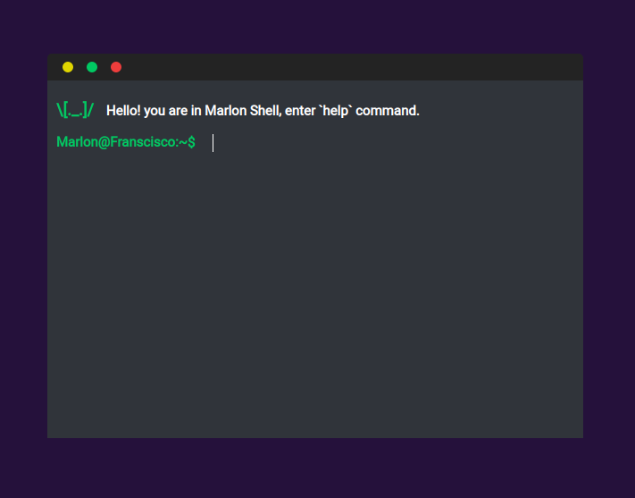

# Terminal apresentation

>   Apresentation curriculum and project



## Run

Instalando dependencias, buildando o projeto e iniciando o servidor.

```sh
    npm install
    npm run build
    npm run dev
```

## Meta

Marlon Francisco – [@Marlon Francisco](https://www.linkedin.com/in/marlon-francisco-a8ab2215b/) – marlon.nascimento2@etec.sp.gov.br

[https://github.com/MarlonFrancisco](https://github.com/MarlonFrancisco)